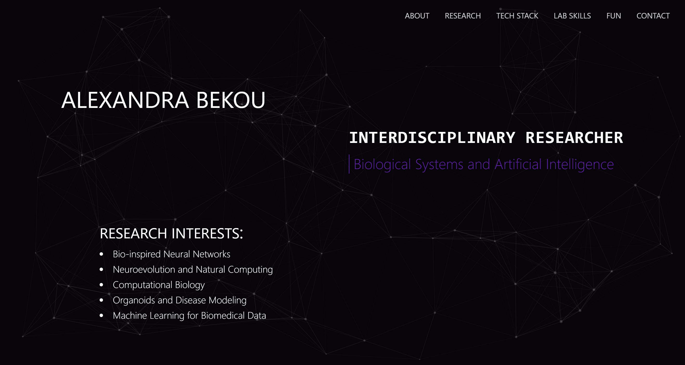

## Description

Minimal UI/UX design personal website built with _React_ & _Vite_ for a bioinformatics / interdisciplinary researcher portfolio.

#### UI/UX Design

- `one-page scroll`
- `smooth scrolling`

#### Sections

1. About
2. Research Projects
3. Tech Stack
4. Lab Skills
5. Fun Projects
6. Contact Information

### Credits

- Interactive particle background: [particles.js](https://github.com/vincentgarreau/particles.js/)

### Color Palette

| Color      | Hex     |
| ---------- | ------- |
| Background | #0b010c |
| Accent #1  | #7e22ce |
| Accent #2  | #16A34A |
